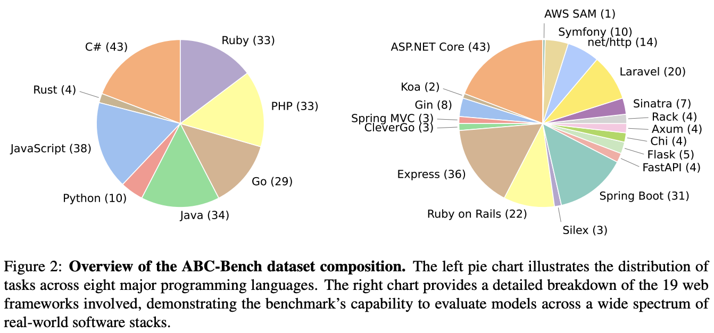
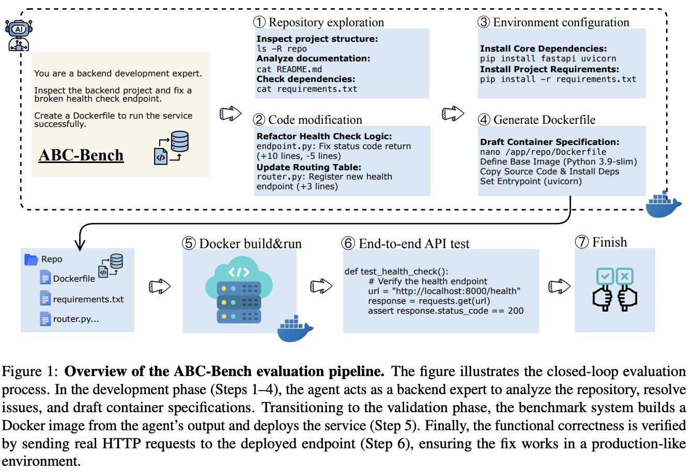

<div align="center">

# ABC-Bench: Benchmarking Agentic Backend Coding in Real-World Development

### 📄 [**Paper**](https://arxiv.org/abs/2601.11077) ｜ 🌐 [**Blog**](https://dawning-road.github.io/blog/abc-bench) ｜ 🤗 [**Dataset**](https://huggingface.co/datasets/OpenMOSS-Team/ABC-Bench)

</div>

> **ABC-Bench** is a benchmark for **A**gentic **B**ackend **C**oding. It evaluates whether code agents can **explore real repositories**, **edit code**, **configure environments**, **deploy containerized services**, and **pass external end-to-end API tests** (HTTP-based integration tests) across realistic backend stacks.

---

## 📰 News
- **2024/01/19**: Public preprint released: *ABC-Bench: Benchmarking Agentic Backend Coding in Real-World Development*.
- **2026/01/19**: Blog post released, detailing benchmark construction and baseline results.  
- **2025/01/20**: Evaluation harness and the full ABC-Bench dataset released on Hugging Face.  

<p align="center">
  
</p>

---

## 🚀 Why ABC-Bench?
- **End-to-End Lifecycle**: repository exploration → code editing/implementation → environment setup → containerized deployment → **external end-to-end API verification**.
- **Real-World Diversity**: **224 tasks** curated from **127 MIT-licensed repositories**, spanning **8 languages** and **19 frameworks**.
- **Environment-Aware Tasks**: **92 tasks** require autonomous environment configuration and containerized service startup.
- **Automated Construction**: built via **ABC-Pipeline** with minimal manual intervention, enabling scalable task creation and future expansions.
- **Challenging Baselines**: even state-of-the-art models remain far from fully reliable.

---

## 📊 Benchmark Composition
<p align="center">
  
</p>

---

## ⚖️ Evaluation Protocol
<p align="center">
  
</p>

---

## 💾 Dataset Access
Download the full benchmark (tasks, build assets, verification suites) on Hugging Face:  
👉 🤗 **[**OpenMOSS-Team/ABC-Bench**](https://huggingface.co/datasets/OpenMOSS-Team/ABC-Bench)**

After downloading, set `--dataset-path` to the **local dataset root directory**.

---

## ⚡ Quickstart

### 1. Prerequisites
- **Docker**
- **Python ≥ 3.10**

### 2. Install Terminal-Bench CLI
```bash
pip install terminal-bench
```

Verify:
```bash
tb --help
```

### 3. Run Evaluation
Replace `<DATASET_PATH>` with your local dataset root directory downloaded from Hugging Face.
```bash
tb run \
  --dataset-path <DATASET_PATH> \
  --agent openhands \
  --model openai/GPT-5 \
  --n-attempts 3 \
  --global-agent-timeout-sec 3600 \
  --global-test-timeout-sec 1800 \
  --n-concurrent 30 \
  --run-id demo
```

---

## 🧠 SFT Models
We provide two models that have been Supervised Fine-Tuned (SFT) specifically for agentic backend coding tasks:

👉 🤗 [**OpenMOSS-Team/Qwen3-8B-ABC**](https://huggingface.co/OpenMOSS-Team/Qwen3-8B-ABC)

👉 🤗 [**OpenMOSS-Team/Qwen3-32B-ABC**](https://huggingface.co/OpenMOSS-Team/Qwen3-32B-ABC)

---

## 🤝 Contributing
Pull requests and issues are welcome. For substantial changes (new scripts, new baselines, major doc updates), please open an issue first.

---

## 📝 Citation
```bibtex
@misc{yang2026abcbenchbenchmarkingagenticbackend,
      title={ABC-Bench: Benchmarking Agentic Backend Coding in Real-World Development}, 
      author={Jie Yang and Honglin Guo and Li Ji and Jiazheng Zhou and Rui Zheng and Zhikai Lei and Shuo Zhang and Zhiheng Xi and Shichun Liu and Yuxin Wang and Bo Wang and Yining Zheng and Tao Gui and Xipeng Qiu},
      year={2026},
      eprint={2601.11077},
      archivePrefix={arXiv},
      primaryClass={cs.SE},
      url={https://arxiv.org/abs/2601.11077}, 
}
```

---

## 🙏 Acknowledgements
ABC-Bench is built from MIT-licensed open-source repositories. We thank the maintainers and contributors whose work makes realistic evaluation possible.
